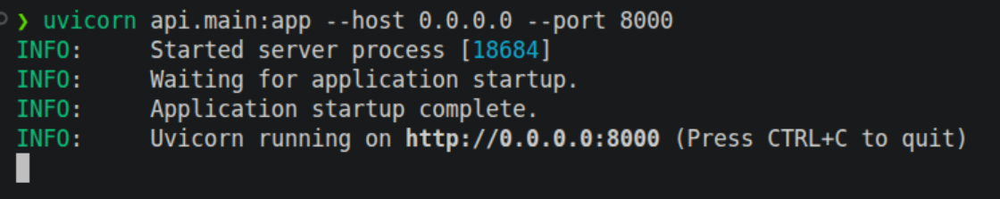
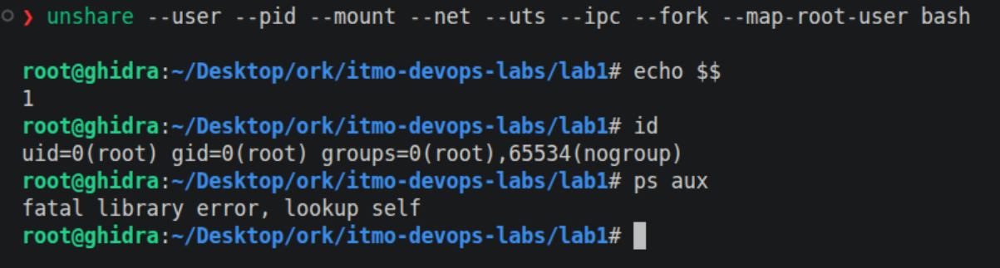
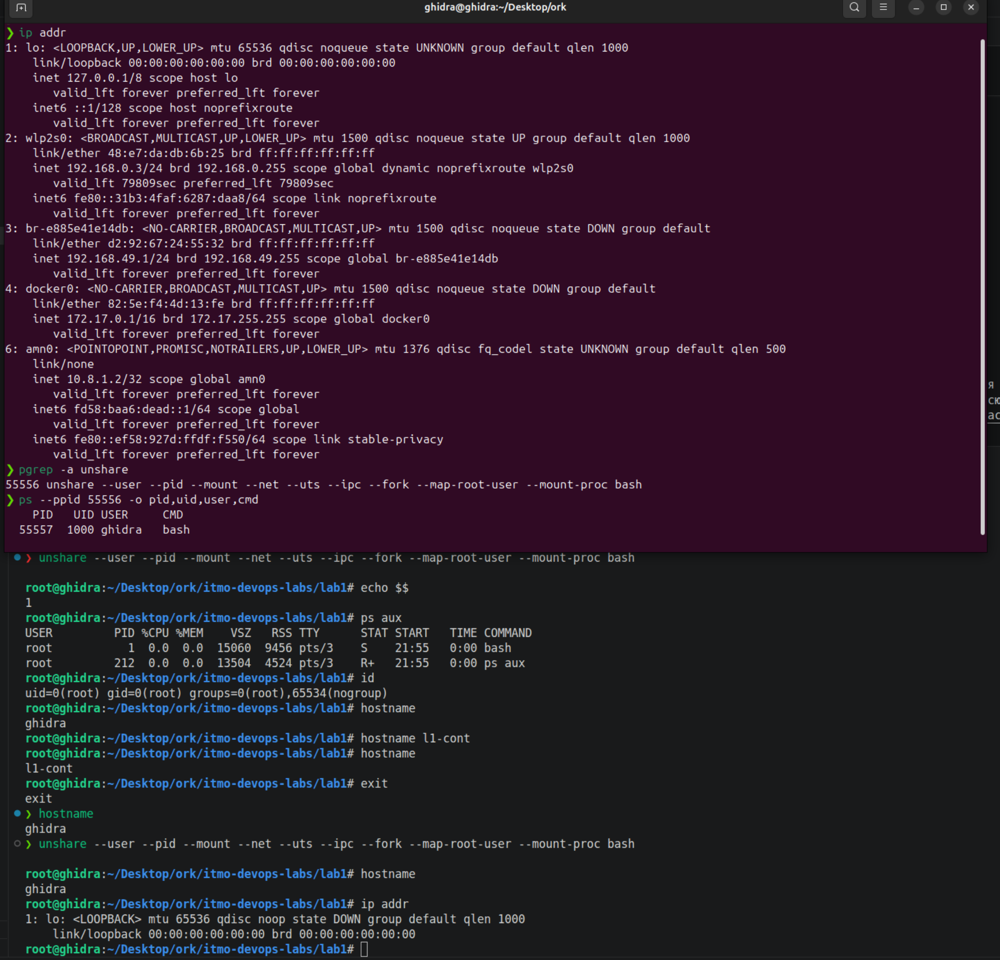
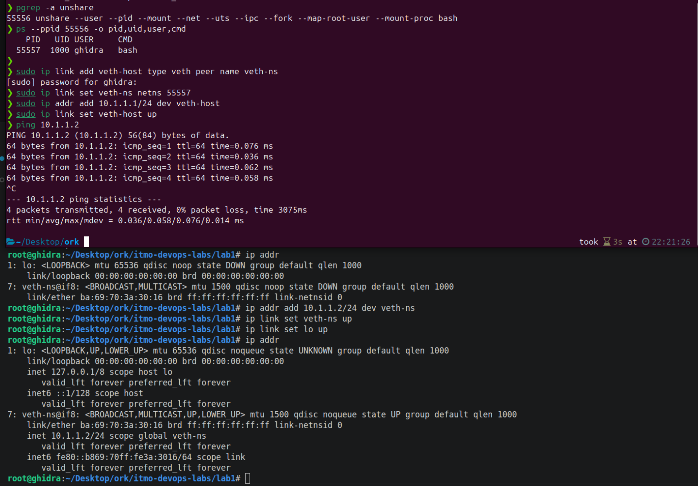
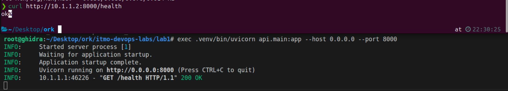

# Лаба 1 - Свой Docker

## Часть 0 - Свой сервис

Был реализован небольшой сервис на Python FastAPI (`api/`, [main.py](api/main.py)) с тремя эндпоинтами: `/health`, `/eat?mb=N` и `/burn`.

Запуск:

```bash
cd lab1

python3 -m venv .venv
source .venv/bin/activate

pip install -r requirements.txt

uvicorn api.main:app --host 0.0.0.0 --port 8000
```

Эндпоинты:

```bash
curl http://127.0.0.1:8000/health   # статус здоровья
curl http://127.0.0.1:8000/eat?mb={N} # выделить N Мб памяти
curl http://127.0.0.1:8000/burn  # нагрузить ядро CPU в бесконечном цикле
```

## Часть 1 - Запуск сервиса

Сначала сервис был запущен без какой-либо изоляции:



Тут же при старте uvicorn был выведен процесс: `18684`

Если искать через ps (также нашли pid `18684`):
```bash
❯ ps -eo pid,cmd | grep '[u]vicorn'
  18684 /home/ghidra/Desktop/ork/itmo-devops-labs/lab1/.venv/bin/python /home/ghidra/Desktop/ork/itmo-devops-labs/lab1/.venv/bin/uvicorn api.main:app --host 0.0.0.0 --port 8000
```

Проверка здоровья вывело ok:

```bash
❯ curl http://127.0.0.1:8000/health
ok
```

То есть подводя итоги на данном шаге у нас процесс работает как обычный процесс хостовой системы, без всякой изоляции и ограничении ресурсов.

## Часть 2 - неймспейсы

Сейчас нам нужно поместить процесс uvicorn в шести NS:

```bash
❯ unshare --user --pid --mount --net --uts --ipc bash
bash: fork: Cannot allocate memory
nobody@ghidra:~/Desktop/ork/itmo-devops-labs/lab1$ 
```

Из вывода сразу видно, что случилось две ошибки: выделение памяти и юзер nobody.

Проблема с nobody связана с тем, как работает флаг `--user`. Он создает user NS, но при этом uid пользователя хоста не сопоставляется с uid внутри созданного NS. А нам как раз нужно чтобы обычный пользователь хоста маппился в uid 0 внутри нашего user NS (юзер nobody вообще это т.н. overflow-user - uid 65534).

У unshare есть такой флаг `--map-root-user`/`-r`, который как раз маппит юзера хоста в uid 0 внутри user NS.

Проблема с памятью опять же связана с тем, как работает флаг `--pid`. PID NS реализуется так, что тот процесс, который собетсвенно и вызывает `unshare`, сам не получает PID внутри NS. Новый pid NS действует для дочерних процессов. Разберем нашу команду:

```bash
unshare --user --pid --mount --net --uts --ipc bash
```

После unshare сам bash остается в прежнем pid NS. А вот когда bash создает первый процесс дочерний через `fork()`, вот тогда этот дочерний процесс и становится pid 1 внутри нашего pid NS. Этот первый дочерний процесс обычно просто какой-нибудь короткоживущий процесс (условно команда из стартап скрипта). То есть этот дочерний процесс выполнился и завершился. А напомню, что это pid 1. Когда pid 1 завершается, ядро считает pid NS завершенным и больше не позволяет создавать в нем процессы новые. Отсюда и возникает эта проблема с выделением памяти (хотя реальная память то не закончилась).  [подробнее тык](https://www.man7.org/linux/man-pages/man7/pid_namespaces.7.html)

Чтобы пофиксить эту проблему, нужно чтобы unshare после создания нового pid NS создавал отдельный дочерний процесс, который попадет в созданный pid NS. Для этого используем флаг `--fork`. И в этом дочернем процессе запускается наш bash с pid 1.

Итого на данном шаге у нас получилось:

```bash
unshare --user --pid --mount --net --uts --ipc --fork --map-root-user bash

# Вывод:
❯ unshare --user --pid --mount --net --uts --ipc --fork --map-root-user bash
root@ghidra:~/Desktop/ork/itmo-devops-labs/lab1# 
```



Как видим bash у нас действительно pid 1, внутри мы теперь root (uid=0). Однако случилась загвоздка:

```bash
root@ghidra:~/Desktop/ork/itmo-devops-labs/lab1# ps aux
fatal library error, lookup self
```

Проблема в том, как у нас смонтирован `/proc`. Мы как бы создали новый mount NS (`--mount`), однако `/proc` в нем просто унаследовался от хоста. И `ps` соответственно не может нормально сопоставить процесс с внутрянкой `/proc`. Почему же `/proc` не внутри mount NS? `--mount` наследует все существующие маунты хоста, отсюда такая проблема. Соответственно, нужно `procfs` перемонтировать внутри нашего mount NS. У unshare для этого есть отдельный флаг `--mount-proc`. Чуть подробнее: [тык](https://unix.stackexchange.com/questions/535528/why-unshare-p-does-not-imply-f-and-mount-proc) и [тык](https://man7.org/linux/man-pages/man1/unshare.1.html)

Тепреь наша команда:

```bash
unshare --user --pid --mount --net --uts --ipc --fork --map-root-user --mount-proc bash
```




Итого что мы тут видим.
1. Внутри процесс pid 1, чужих процессов нет (`ps aux`)
2. У него свое имя хоста и пустая сеть
3. Как и говорилось, смаппился хостовой юзер (не рут) в нулевого uid (рут) внутри нашего user NS 

Осталось только запустить наш сервис (заменить bash на uvicorn). Это можно сделать с помощью exec (подменит bash на uvicorn с тем же pid 1). Но перед этим вспомним, что нам же нужно как-то с хоста достучаться до нашего сервиса. То есть нужно настроить сеть.

Для этого создадим veth-пару. Один конец мы оставим на хосте, а второй соответственно в netns.



Что мы тут натворили.

Мы создали veth-пару: veth-host (10.1.1.1) - на хосте, veth-ns (10.1.1.2) - внутри netns.

Сначала мы ищем bash pid, который работает внутри ns:

```bash
pgrep -a unshare
#Вывод
55556 unshare --user --pid --mount --net --uts --ipc --fork --map-root-user --mount-proc bash

ps --ppid 55556 -o pid,uid,user,cmd
#Вывод
PID   UID USER     CMD
55557  1000 ghidra   bash

```

После чего на хосте была создана veth-пара:
```bash
sudo ip link add veth-host type veth peer name veth-ns
```

Интерфейс veth-ns перенесли в netns нашего процесса:
```bash
sudo ip link set veth-ns netns 55557
```

В свою очередь на хостовой стороне назначаем адрес интерфейсу:
```bash
sudo ip addr add 10.1.1.1/24 dev veth-host
sudo ip link set veth-host up
```

Аналогично назначаем адрес интерфейсу внутри netns (после переноса он там появился как отдельный интерфейс):
```bash
ip addr add 10.1.1.2/24 dev veth-ns
ip link set veth-ns up
ip link set lo up
```

После чего проверили соедиение обычным пингом.

Сеть настроили. Дальше меняем наш bash на uvicorn:
```bash
root@ghidra:~/Desktop/ork/itmo-devops-labs/lab1# exec .venv/bin/uvicorn api.main:app --host 0.0.0.0 --port 8000
INFO:     Started server process [1]
INFO:     Waiting for application startup.
INFO:     Application startup complete.
INFO:     Uvicorn running on http://0.0.0.0:8000 (Press CTRL+C to quit)
```

И в итоге проверка:



На данный момент все круто. Напишем первую часть `mydocker.sh` и переходим к cgroups.

И еще описание кто что изолирует:
- user ns - изолирует пользователей (uid/gid)
- pid - изолирует дерево процессов и pid
- mount - изолирует точки монтирования файловых систем
- net - изолирует сетевой стек (интерфейсы, адреса, маршруты и тд)
- uts - изолирует хостнейм и доменное имя
- ipc - изолирует ipc механизмы (семафоры, очереди, сокеты...)

