# Лаба 1 - Свой Docker

## Часть 0 - Свой сервис

Был реализован небольшой сервис на Python FastAPI (`api/`, [main.py](api/main.py)) с тремя эндпоинтами: `/health`, `/eat?mb=N` и `/burn`.

Запуск:

```bash
cd lab1

python3 -m venv .venv
source .venv/bin/activate

pip install -r requirements.txt

uvicorn api.main:app --host 0.0.0.0 --port 8000
```

Эндпоинты:

```bash
curl http://127.0.0.1:8000/health   # статус здоровья
curl http://127.0.0.1:8000/eat?mb={N} # выделить N Мб памяти
curl http://127.0.0.1:8000/burn  # нагрузить ядро CPU в бесконечном цикле
```

Запуск `mydocker.sh`:

```bash
cd lab1
./mydocker.sh
```

## Часть 1 - Запуск сервиса

Сначала сервис был запущен без какой-либо изоляции:


Тут же при старте uvicorn был выведен процесс: `18684`

Если искать через ps (также нашли pid `18684`):
```bash
❯ ps -eo pid,cmd | grep '[u]vicorn'
  18684 /home/ghidra/Desktop/ork/itmo-devops-labs/lab1/.venv/bin/python /home/ghidra/Desktop/ork/itmo-devops-labs/lab1/.venv/bin/uvicorn api.main:app --host 0.0.0.0 --port 8000
```

Проверка здоровья вывело ok:

```bash
❯ curl http://127.0.0.1:8000/health
ok
```

То есть подводя итоги на данном шаге у нас процесс работает как обычный процесс хостовой системы, без всякой изоляции и ограничении ресурсов.

## Часть 2 - неймспейсы

Сейчас нам нужно поместить процесс uvicorn в шести NS:

```bash
❯ unshare --user --pid --mount --net --uts --ipc bash
bash: fork: Cannot allocate memory
nobody@ghidra:~/Desktop/ork/itmo-devops-labs/lab1$ 
```

Из вывода сразу видно, что случилось две ошибки: выделение памяти и юзер nobody.

Проблема с nobody связана с тем, как работает флаг `--user`. Он создает user NS, но при этом uid пользователя хоста не сопоставляется с uid внутри созданного NS. А нам как раз нужно чтобы обычный пользователь хоста маппился в uid 0 внутри нашего user NS (юзер nobody вообще это т.н. overflow-user - uid 65534).

У unshare есть такой флаг `--map-root-user`/`-r`, который как раз маппит юзера хоста в uid 0 внутри user NS.

Проблема с памятью опять же связана с тем, как работает флаг `--pid`. PID NS реализуется так, что тот процесс, который собетсвенно и вызывает `unshare`, сам не получает PID внутри NS. Новый pid NS действует для дочерних процессов. Разберем нашу команду:

```bash
unshare --user --pid --mount --net --uts --ipc bash
```

После unshare сам bash остается в прежнем pid NS. А вот когда bash создает первый процесс дочерний через `fork()`, вот тогда этот дочерний процесс и становится pid 1 внутри нашего pid NS. Этот первый дочерний процесс обычно просто какой-нибудь короткоживущий процесс (условно команда из стартап скрипта). То есть этот дочерний процесс выполнился и завершился. А напомню, что это pid 1. Когда pid 1 завершается, ядро считает pid NS завершенным и больше не позволяет создавать в нем процессы новые. Отсюда и возникает эта проблема с выделением памяти (хотя реальная память то не закончилась).  [подробнее тык](https://www.man7.org/linux/man-pages/man7/pid_namespaces.7.html)

Чтобы пофиксить эту проблему, нужно чтобы unshare после создания нового pid NS создавал отдельный дочерний процесс, который попадет в созданный pid NS. Для этого используем флаг `--fork`. И в этом дочернем процессе запускается наш bash с pid 1.

Итого на данном шаге у нас получилось:

```bash
unshare --user --pid --mount --net --uts --ipc --fork --map-root-user bash

# Вывод:
❯ unshare --user --pid --mount --net --uts --ipc --fork --map-root-user bash
root@ghidra:~/Desktop/ork/itmo-devops-labs/lab1# 
```


Как видим bash у нас действительно pid 1, внутри мы теперь root (uid=0). Однако случилась загвоздка:

```bash
root@ghidra:~/Desktop/ork/itmo-devops-labs/lab1# ps aux
fatal library error, lookup self
```

Проблема в том, как у нас смонтирован `/proc`. Мы как бы создали новый mount NS (`--mount`), однако `/proc` в нем просто унаследовался от хоста. И `ps` соответственно не может нормально сопоставить процесс с внутрянкой `/proc`. Почему же `/proc` не внутри mount NS? `--mount` наследует все существующие маунты хоста, отсюда такая проблема. Соответственно, нужно `procfs` перемонтировать внутри нашего mount NS. У unshare для этого есть отдельный флаг `--mount-proc`. Чуть подробнее: [тык](https://unix.stackexchange.com/questions/535528/why-unshare-p-does-not-imply-f-and-mount-proc) и [тык](https://man7.org/linux/man-pages/man1/unshare.1.html)

Тепреь наша команда:

```bash
unshare --user --pid --mount --net --uts --ipc --fork --map-root-user --mount-proc bash
```


Итого что мы тут видим.
1. Внутри процесс pid 1, чужих процессов нет (`ps aux`)
2. У него свое имя хоста и пустая сеть
3. Как и говорилось, смаппился хостовой юзер (не рут) в нулевого uid (рут) внутри нашего user NS 

Осталось только запустить наш сервис (заменить bash на uvicorn). Это можно сделать с помощью exec (подменит bash на uvicorn с тем же pid 1). Но перед этим вспомним, что нам же нужно как-то с хоста достучаться до нашего сервиса. То есть нужно настроить сеть.

Для этого создадим veth-пару. Один конец мы оставим на хосте, а второй соответственно в netns.


Что мы тут натворили.

Мы создали veth-пару: veth-host (10.1.1.1) - на хосте, veth-ns (10.1.1.2) - внутри netns.

Сначала мы ищем bash pid, который работает внутри ns:

```bash
pgrep -a unshare
#Вывод
55556 unshare --user --pid --mount --net --uts --ipc --fork --map-root-user --mount-proc bash

ps --ppid 55556 -o pid,uid,user,cmd
#Вывод
PID   UID USER     CMD
55557  1000 ghidra   bash

```

После чего на хосте была создана veth-пара:
```bash
sudo ip link add veth-host type veth peer name veth-ns
```

Интерфейс veth-ns перенесли в netns нашего процесса:
```bash
sudo ip link set veth-ns netns 55557
```

В свою очередь на хостовой стороне назначаем адрес интерфейсу:
```bash
sudo ip addr add 10.1.1.1/24 dev veth-host
sudo ip link set veth-host up
```

Аналогично назначаем адрес интерфейсу внутри netns (после переноса он там появился как отдельный интерфейс):
```bash
ip addr add 10.1.1.2/24 dev veth-ns
ip link set veth-ns up
ip link set lo up
```

После чего проверили соедиение обычным пингом.

Сеть настроили. Дальше меняем наш bash на uvicorn:
```bash
root@ghidra:~/Desktop/ork/itmo-devops-labs/lab1# exec .venv/bin/uvicorn api.main:app --host 0.0.0.0 --port 8000
INFO:     Started server process [1]
INFO:     Waiting for application startup.
INFO:     Application startup complete.
INFO:     Uvicorn running on http://0.0.0.0:8000 (Press CTRL+C to quit)
```

И в итоге проверка:


На данный момент все круто. Напишем первую часть `mydocker.sh` и переходим к cgroups.

И еще описание кто что изолирует:
- user ns - изолирует пользователей (uid/gid)
- pid - изолирует дерево процессов и pid
- mount - изолирует точки монтирования файловых систем
- net - изолирует сетевой стек (интерфейсы, адреса, маршруты и тд)
- uts - изолирует хостнейм и доменное имя
- ipc - изолирует ipc механизмы (семафоры, очереди, сокеты...)

---

## Часть 3 - cgroups

Сначала мы убедились, что на хосте используется cgroup v2 и доступные контроллеры:
```bash
❯ stat -fc %T /sys/fs/cgroup
cgroup2fs

❯ cat /sys/fs/cgroup/cgroup.controllers
cpuset cpu io memory hugetlb pids rdma misc dmem
```

Все круто. У нас cgroup v2 и есть контроллеры cpu/memory/pids. Переходим к созданию cgroups.

Запускаем наш `mydocker.sh`, получаем хостовый pid uvicorn (потому что cgroup настраивается со стороны хоста). Создаем cgroup:

```bash
❯ sudo mkdir /sys/fs/cgroup/lab1
❯ ls -la /sys/fs/cgroup/lab1
total 0
drwxr-xr-x  2 root root 0 Sep 20 23:01 .
dr-xr-xr-x 13 root root 0 Sep 20 23:01 ..
-r--r--r--  1 root root 0 Sep 20 23:01 cgroup.controllers
-r--r--r--  1 root root 0 Sep 20 23:01 cgroup.events
-rw-r--r--  1 root root 0 Sep 20 23:01 cgroup.freeze
--w-------  1 root root 0 Sep 20 23:01 cgroup.kill
-rw-r--r--  1 root root 0 Sep 20 23:01 cgroup.max.depth
...
```

Для поставленной задачи нас впервую очередь интересуют:
- cgroup.procs (pid процессов, которые входят в cgroup)
- memory.max (лимит по памяти)
- memory.current (текущий объем памяти в байтах)
- memory.events (события, которые происходят в cgroup)
- cpu.max (лимит по cpu, квота процессорного времени)
- cpu.stat (статистика использования cpu, троттлинг)
- pids.max (максимальное количество процессов в cgroup)
- pids.current (текущее количество процессов в cgroup)

Пробуем разместить наш uvicorn процесс в созданный cgroup:
```bash
echo 82962 | sudo tee /sys/fs/cgroup/lab1/cgroup.procs  # 82962 - host pid uvicorn

❯ cat /proc/82962/cgroup
0::/lab1 # помещенный процесс в созданный cgroup
```

Навесим лимит по памяти. Пусть будет лимит в 32 мб. Чтобы повесить лимит в 32 мб, нужно записать в файл `/sys/fs/cgroup/lab1/memory.max`:
```bash
❯ echo $((32 * 1024 * 1024)) | sudo tee /sys/fs/cgroup/lab1/memory.max
```

Теперь попробуем словить оом. Курлим `/eat?mb=100`:
```bash
❯ curl 'http://10.1.1.2:8000/eat?mb=100'
{"allocated_mb":100,"total_allocations":1}

❯ cat /sys/fs/cgroup/lab1/memory.events
low 0
high 0
max 318
oom 0
oom_kill 0
oom_group_kill 0
sock_throttled 0
```

ООМ не словили :(. Но видно, что мы 318 раз упирались в memory.max. Возможно виновник - swap. Проверим:

```bash
❯ cat /sys/fs/cgroup/lab1/memory.swap.max 
max # swap не ограничен

❯ cat /sys/fs/cgroup/lab1/memory.swap.current
74170368 # ~74 мб

❯ cat /sys/fs/cgroup/lab1/memory.current
33087488 # ~32 мб
```

Походу и правда беда в swap (точнее swap засейвил от ООМ). То есть RAM дошел до 32 мб, уперся в лимит, ядро начало вытеснять страницы в swap. Запретим swap:

```bash
❯ echo 0 | sudo tee /sys/fs/cgroup/lab1/memory.swap.max
0
```

И получилось словить ООМ:

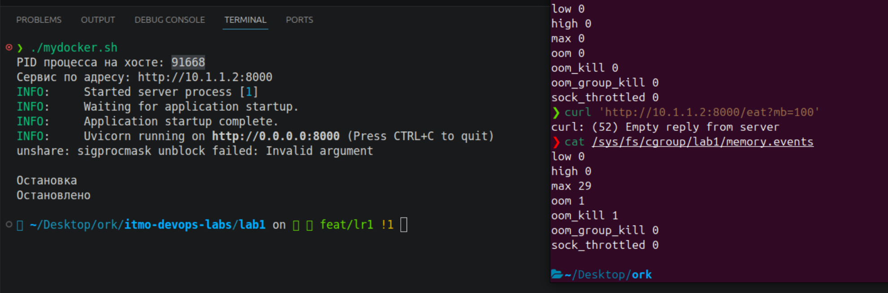

Пустой ответ от сервера, потому что uvicorn убился во время обработки `/eat`

Переходим к ограничению CPU. Допустим задаём лимит на 0.5 CPU:
```bash
❯ echo "50000 100000" | sudo tee /sys/fs/cgroup/lab1/cpu.max
50000 100000
```

Что это значит? Это значит, что за каждые 100000 мкс процессу разрешено использовать цпу только 50000 мкс. То есть получается 50000/100000 = 0.5 CPU.

Снимим статистику до теста `/burn`:
```bash
❯ cat /sys/fs/cgroup/lab1/cpu.stat
usage_usec 156818
user_usec 112331
system_usec 44487
nice_usec 0
core_sched.force_idle_usec 0
nr_periods 27
nr_throttled 0
throttled_usec 0
nr_bursts 0
burst_usec 0
```

Запускаем наш `/burn`:
```bash
❯ curl http://10.1.1.2:8000/burn
❯ cat /sys/fs/cgroup/lab1/cpu.stat
usage_usec 16922377
user_usec 16840699
system_usec 81678
nice_usec 0
core_sched.force_idle_usec 0
nr_periods 770
nr_throttled 330
throttled_usec 16715042
nr_bursts 0
burst_usec 0
```

Словили троттлинг! Процесс 330 раз (`nr_throttled`) был ограницен по цпу (`throttled_usec` - время, в течение которого выполнение процесса было приостановлено).

Переходим к ограничению количетсва процессов, оно же `pids.max`:

```bash
❯ echo 20 | sudo tee /sys/fs/cgroup/lab1/pids.max # ограничиваем кол-во процессов
20
```

До запуска нагрузки в cgroup было 7 процессов и 0 попыток форков процессов за установленный лимит:
```bash
❯ cat /sys/fs/cgroup/lab1/pids.current
7

❯ cat /sys/fs/cgroup/lab1/pids.events
max 0
```

После чего стартуем форк-бомбу через `stress-ng` и параллельно смотрим максимальное количество процессов в cgroup:
```bash
❯ bash -c '
    echo $$ | sudo tee /sys/fs/cgroup/lab1/cgroup.procs >/dev/null
    exec stress-ng --fork 50 --timeout 10s
' # запуск 50 форк-стрессеров
stress-ng: info:  [100423] setting to a 10 secs run per stressor
stress-ng: info:  [100423] dispatching hogs: 50 fork
stress-ng: warn:  [100423] WARNING! using HPET clocksource (refer to /sys/devices/system/clocksource/clocksource0), this may impact benchmarking performance

❯ cat /sys/fs/cgroup/lab1/pids.current
20 # уперлись в максимум

❯ cat /sys/fs/cgroup/lab1/pids.events
max 184103 # это число попыток создать процесс, которые уперлись в максимум
```

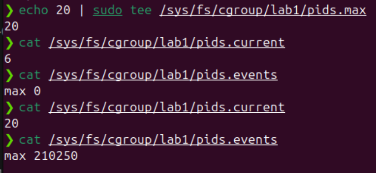

---

## Часть 4 - права

Разберемся сначала с capabilities. Они отвечаеют за то, какие привилегированные операции процессу разрешены.

В лине права рут разбиты на отдельные capabilities (одна разрешает операции с сетью, вторая менять владельцев файла и тд).

Нам же нужно сбросить все capabilities перед запуском процесса uvicorn, согласно принципу минимальный привилегий. Будем использовать утилиту `capsh`, которая позволяет как раз таки сконфигурировать capabilities:

```bash
exec capsh --drop=all --caps= --noamb -- -c '
    exec .venv/bin/uvicorn api.main:app --host 0.0.0.0 --port 8000
'
```

Флаг `--drop=all` удаляет все capabilities из bounding set (это как бы список привилегий, которые процесс сможет получить в будущем), `--caps=` очищает текущий набор capabilities, `--noamb` убирает capabilities из ambient set (привилегии, которые могут протащиться через exec в uvicorn)

После этой команды у нас uvicorn также будет иметь uid 0, но будут сброшены все capabilities.

Привилегии до сброса:
```bash
CapInh: 0000000000000000
CapPrm: 000001ffffffffff
CapEff: 000001ffffffffff
CapBnd: 000001ffffffffff
CapAmb: 0000000000000000
```

После:
```bash
CapInh: 0000000000000000
CapPrm: 0000000000000000
CapEff: 0000000000000000
CapBnd: 0000000000000000
CapAmb: 0000000000000000
```

Попытка сменить hostname тоже увенчалась неудачей:

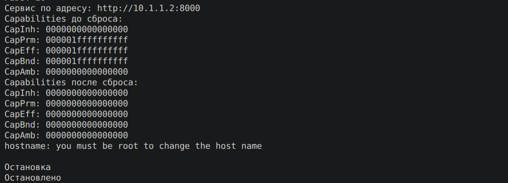

Переходим к seccomp. Этот механиз ограничивает syscalls. Можно это реализовать через `libseccomp`, через питоновскую обертку `python3-seccomp`, или использовать `setpriv --seccomp-filter`. Пойдем путем проще, тянуть libseccomp на C не будем, писать BPF фильтры не будем, используем питон:

```bash
sudo apt install python3-seccomp
```

Нам нужен least privilege. Узнаем через strace какие syscalls вызываются:

```bash
❯ strace -ff -o /tmp/uvicorn.trace \
    .venv/bin/uvicorn api.main:app \
    --host 0.0.0.0 \
    --port 8000
...
❯ grep -hE '^[a-zA-Z_][a-zA-Z0-9_]*\(' /tmp/uvicorn.trace* \
    | sed -E 's/^([a-zA-Z_][a-zA-Z0-9_]*)\(.*/\1/' \
    | sort -u
accept4
access
arch_prctl
bind
...
```

Собрали системные вызовы. Добавляем в фильтр [seccomp_runner.py](seccomp_runner.py). Проверяем:

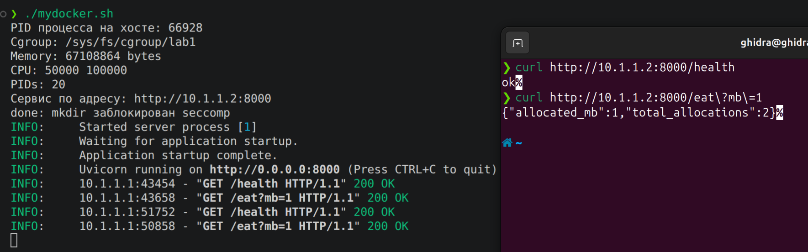

Левый системный вызов был заблокирован (создание директории).

---

## Часть 5 - Свой Docker

Собираем финальный [mydocker.sh](mydocker.sh). При запуске и вызова api все работает:

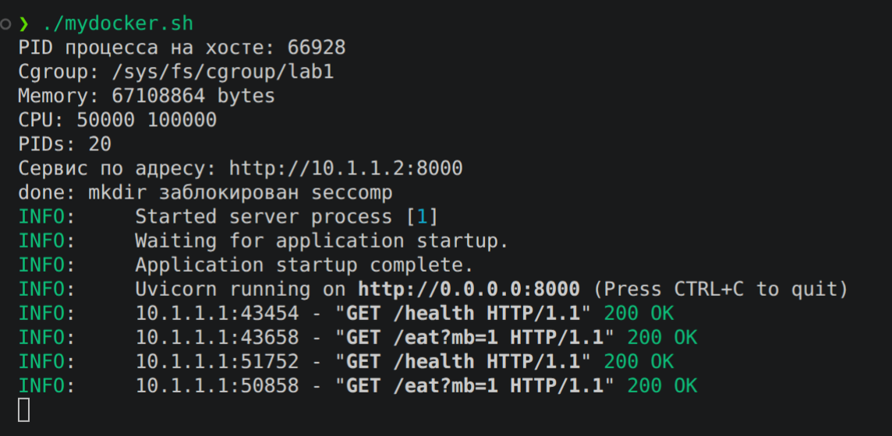

Подводя итог, скрипт создает 6 NS, veth, cgroup v2, сбрасывает привилегии, оставляет необходимые syscalls, pid 1 - uvicorn, внутри uid 0, снаружи не рут.

Теперь запустим все это через docker. Реализуем простенький [Dockerfile.simple](Dockerfile.simple). Образ будет на основе `python:3.12-slim`, устанавливаем рабочую директорию `/app`, копируем внутрь requirements.txt, устанавливаем зависимости, копируем наш `api`, и стартуем uvicorn.

Собираем образ:
```bash
docker build -t lab1-api .
```

Контейнер запустим аналогично тому, как работает наш скрипт:
```bash
docker run --rm \
  --name lab1-api \
  --hostname l1-cont \
  --memory=64m \
  --memory-swap=64m \ # пусть все-таки будет 64 мб на свап
  --cpus=0.5 \
  --pids-limit=20 \
  --cap-drop=ALL \
  -p 8000:8000 \
  lab1-api
```

Сравним:

| Механизм | наш скрипт | докер |
|---|---|---|
| NS | создаётся через `unshare` | создаётся автоматически |
| Ограничение памяти/swap/cpu | cgroup v2 | `--memory` (тоже cgroup) |
| Привилегии | вручную через `capsh` | используется `--cap-drop=ALL` |
| Seccomp | разрешенный список через `libseccomp/python3-seccomp` | докер применяет дефолт seccomp-профиль, также можно навесить свой профиль |
| Сеть | veth-пара создаётся и настраивается вручную | докер автоматически создаёт veth и подключает контейнер к bridge |
| Образы | нет | докер образ состоит из слоёв |
| DNS | нет | докер настраивает DNS контейнера |
| Volumes | нет | докер поддерживает тома |

И главное отличие - ФС. mount NS изолирует таблицу монтирования, но процесс все же видит корневую ФС хоста. То есть скрипт не использует `pivot_root`, не реализует слои образа.

---

## Часть 6 - Образы

Соберем сначала образ без multi-stage:

```bash
❯ docker build -f Dockerfile.simple -t lab1-api:simple .
```

Посмотрим размер нашего образа:

```bash
❯ docker image ls lab1-api
IMAGE             ID             DISK USAGE   CONTENT SIZE   EXTRA
lab1-api:simple   b07371df6cd9        167MB             0B        
```

Заодно глянем слои:

```bash
❯ docker history lab1-api:simple
IMAGE          CREATED         CREATED BY                                      SIZE      COMMENT
b07371df6cd9   7 minutes ago   CMD ["uvicorn" "api.main:app" "--host" "0.0.…   0B        buildkit.dockerfile.v0
<missing>      7 minutes ago   COPY api ./api # buildkit                       1.81kB    buildkit.dockerfile.v0
<missing>      7 minutes ago   RUN /bin/sh -c pip install --no-cache-dir -r…   47.7MB    buildkit.dockerfile.v0
<missing>      7 minutes ago   COPY requirements.txt . # buildkit              25B       buildkit.dockerfile.v0
<missing>      7 minutes ago   WORKDIR /app                                    0B        buildkit.dockerfile.v0
<missing>      2 days ago      CMD ["python3"]                                 0B        buildkit.dockerfile.v0
<missing>      2 days ago      RUN /bin/sh -c set -eux;  for src in idle3 p…   36B       buildkit.dockerfile.v0
<missing>      2 days ago      RUN /bin/sh -c set -eux;   savedAptMark="$(a…   36.8MB    buildkit.dockerfile.v0
<missing>      2 days ago      ENV PYTHON_SHA256=5c8462af5790baf43a321a1559…   0B        buildkit.dockerfile.v0
<missing>      2 days ago      ENV PYTHON_VERSION=3.12.14                      0B        buildkit.dockerfile.v0
<missing>      2 days ago      ENV GPG_KEY=7169605F62C751356D054A26A821E680…   0B        buildkit.dockerfile.v0
<missing>      2 days ago      RUN /bin/sh -c set -eux;  apt-get update;  a…   3.81MB    buildkit.dockerfile.v0
<missing>      2 days ago      ENV LANG=C.UTF-8                                0B        buildkit.dockerfile.v0
<missing>      2 days ago      ENV PATH=/usr/local/bin:/usr/local/sbin:/usr…   0B        buildkit.dockerfile.v0
<missing>      3 days ago      # debian.sh --arch 'amd64' out/ 'trixie' '@1…   78.8MB    debuerreotype 0.17
```

Теперь реализуем [multi-stage](Dockerfile). Логика будет такая. Сначала билдер соберет все необходимое для сборки (python + зависимости). Потом вторым этапом возьмем за основу python:3.12-slim и скопируем зависимости с первого шага в образ (билдер не попадает целиком в финальный образ).

Собираем образ:

```bash 
❯ docker build -t lab1-api:multi .
```

Смотрим размер образа:

```bash
❯ docker image ls lab1-api
IMAGE             ID             DISK USAGE   CONTENT SIZE   EXTRA
lab1-api:multi    248d2e7ede89        170MB             0B        
```

И слои:

```bash
❯ docker history lab1-api:multi
IMAGE          CREATED          CREATED BY                                      SIZE      COMMENT
248d2e7ede89   17 seconds ago   CMD ["uvicorn" "api.main:app" "--host" "0.0.…   0B        buildkit.dockerfile.v0
<missing>      17 seconds ago   COPY api ./api # buildkit                       1.81kB    buildkit.dockerfile.v0
<missing>      17 seconds ago   ENV PATH=/opt/venv/bin:/usr/local/bin:/usr/l…   0B        buildkit.dockerfile.v0
<missing>      17 seconds ago   COPY /opt/venv /opt/venv # buildkit             50.7MB    buildkit.dockerfile.v0
<missing>      12 minutes ago   WORKDIR /app                                    0B        buildkit.dockerfile.v0
<missing>      2 days ago       CMD ["python3"]                                 0B        buildkit.dockerfile.v0
<missing>      2 days ago       RUN /bin/sh -c set -eux;  for src in idle3 p…   36B       buildkit.dockerfile.v0
<missing>      2 days ago       RUN /bin/sh -c set -eux;   savedAptMark="$(a…   36.8MB    buildkit.dockerfile.v0
<missing>      2 days ago       ENV PYTHON_SHA256=5c8462af5790baf43a321a1559…   0B        buildkit.dockerfile.v0
<missing>      2 days ago       ENV PYTHON_VERSION=3.12.14                      0B        buildkit.dockerfile.v0
<missing>      2 days ago       ENV GPG_KEY=7169605F62C751356D054A26A821E680…   0B        buildkit.dockerfile.v0
<missing>      2 days ago       RUN /bin/sh -c set -eux;  apt-get update;  a…   3.81MB    buildkit.dockerfile.v0
<missing>      2 days ago       ENV LANG=C.UTF-8                                0B        buildkit.dockerfile.v0
<missing>      2 days ago       ENV PATH=/usr/local/bin:/usr/local/sbin:/usr…   0B        buildkit.dockerfile.v0
<missing>      3 days ago       # debian.sh --arch 'amd64' out/ 'trixie' '@1…   78.8MB    debuerreotype 0.17
```

И тут получилось, что multi-stage получился больше по размеру на 3 мб. Тут получилось, что:

```bash
# Без multi-stage
<missing>      7 minutes ago   RUN /bin/sh -c pip install --no-cache-dir -r…   47.7MB    buildkit.dockerfile.v0

# С multi-stage
<missing>      17 seconds ago   COPY /opt/venv /opt/venv # buildkit             50.7MB    buildkit.dockerfile.v0
```

В билдере создается виртуальное окружение, которое затем целиком копируется в рантайм образ. Но это не значит что multi-stage не работает. Работает, просто приложение не требует тяжелых инструментов для сборки (например не тянет какой-нибудь gcc/build-essential), из-за чего не виден эффект.

Количество слоев ФС образов:
- simple: 8 слоев
- multi: 7 слоев (меньше потому что нет RUN)

```bash
❯ docker image inspect lab1-api:simple \
  --format '{{len .RootFS.Layers}}'
8

❯ docker image inspect lab1-api:multi \
  --format '{{len .RootFS.Layers}}'
7
```

`docker history` показывает по 15 строк, потому что там также отображаются metadata инстркуции, которые не создают отдельные слои ФС.

Теперь про переиспользование из кэша:

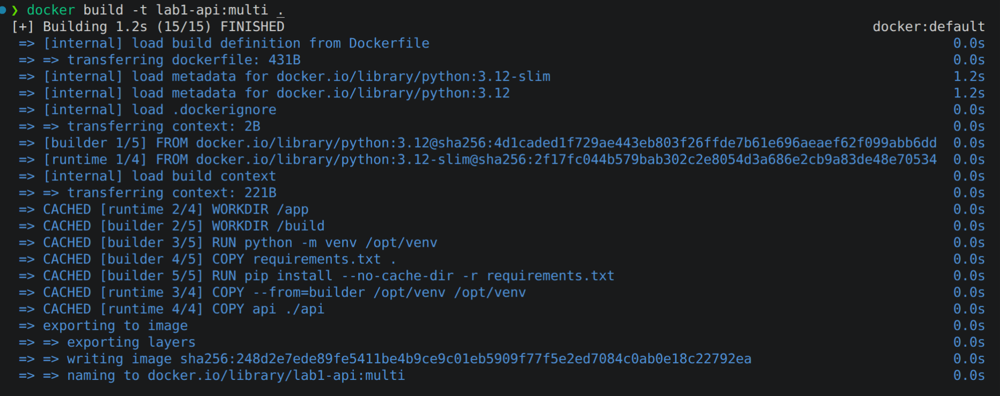

То есть при повторной сборке (без измененией) докер переиспользовал билд кэш. Взяты были создание рабочего каталога, виртуального окружения, копирование requirements, установка зависимостей, копирование `/opt/venv` и копирование исходного кода api (все где пометки CACHED). Такая повторная сборка заняла 1.2 секунды (без кэша было 36.9 секунд).

Теперь запустим контейнер без вольюма, запишем туда файлик, перезапустим контейнер - файлик пропадет:

```bash
❯ docker run -d \
  --name lab1-cont \
  lab1-api:multi
3f25f7fe047ea9af5d0a9af4449d4b5fa71ea35645d0317478ae371f1738621c

❯ docker exec lab1-cont \
  sh -c 'echo "hello" > /tmp/test.txt'

❯ docker exec lab1-cont cat /tmp/test.txt
hello

❯ docker rm -f lab1-cont
lab1-cont

❯ docker run -d \
  --name lab1-cont \
  lab1-api:multi
dce14fce4ee2ef268cdbb3d5fea28f09bf51fe338348654b42afa9f41d534733

❯ docker exec lab1-cont cat /tmp/test.txt
cat: /tmp/test.txt: No such file or directory
```

А теперь подключим вольюм:

```bash
❯ docker volume create lab1-data

❯ docker run -d \
  --name lab1-cont \
  -v lab1-data:/data \
  lab1-api:multi
lab1-data
ef70b4e3b13c494c0a972017b4b821bcedf3c629c46b74c69b63aa7a045336ce

❯ docker exec lab1-cont \
  sh -c 'echo "hello" > /data/test.txt'

❯ docker exec lab1-cont cat /data/test.txt
hello

❯ docker rm -f lab1-cont
lab1-cont

❯ docker run -d \
  --name lab1-cont \
  -v lab1-data:/data \
  lab1-api:multi
78dcf16c04e23698600ba646c2947cc28dd02e43a887255aa2afb2e99640d0f9

❯ docker exec lab1-cont cat /data/test.txt
hello # файл остался
```

Данные без вольюма пропадают, потому что они записываются в writable слой. При удалении контейнера этот слой удаляется вместе с ним, собственно поэтому созданные файлы внутри пропадают. Вольюм же отдельно храниться от цикла контейнера, поэтому данные остаются после удаления контейнера.

---

## Часть 7 -  gVisor

Сначала установим gVisor и проверим рантайм docker (после установки gVisor должен появиться runsc (OCI runtime gVisor)):

```bash
❯ docker info | grep -i runtimes
Runtimes: io.containerd.runc.v2 runc runsc
```

Теперь запустим наш образ через gVisor:

```bash
❯ docker run --rm \
  --runtime=runsc \
  --name lab1-gvisor \
  --hostname l1-cont \
  --memory=64m \
  --memory-swap=128m \
  --cpus=0.5 \
  --pids-limit=20 \
  --cap-drop=ALL \
  -p 8000:8000 \
  lab1-api:multi

docker: Error response from daemon: failed to create task for container: failed to create shim task: OCI runtime create failed: creating container: cannot create sandbox: cannot read client sync file: waiting for sandbox to start: EOF
```

У нас появилась странная ошибка при старте контейнера. Методом перебора флагов выяснилось, что виновник - `--pids-limit=20` (увеличив этот лимит все заработало).

Разобрав ошибку, можно понять, что проблема заключается в том, что при запуске gVisor sandbox, сам sandbox умирает во время старта. А runsc вместо сигнала готовности получил EOF.

А теперь чуть глубже посмотрим, что конкретно случилось. Зарегаем отдельный рантайм (пусть будет `runsc-debug`) с включенным дебаг режимом:

```bash
❯ sudo mkdir -p /tmp/runsc-debug
❯ sudo runsc install --runtime runsc-debug -- \
  --debug \
  --debug-log=/tmp/runsc-debug/
```

Запустим наш образ снова с `--pids-limit=20` но уже под дебаг runsc. Всё, запустили, логи собрали, теперь смотрим их. Грепнем по ключевым словам и посмотрим что нашлось:

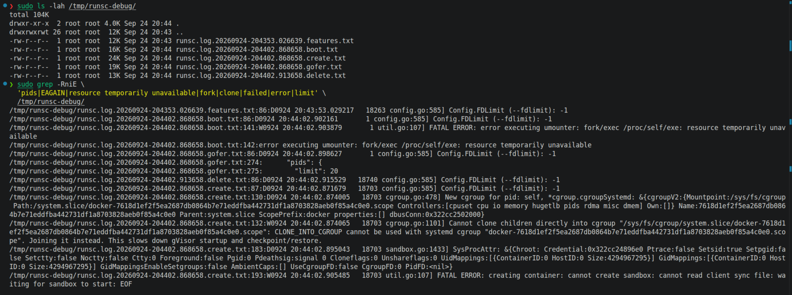

И вот мы видим `error executing umounter: fork/exec /proc/self/exe: resource temporarily unavailable`. Runsc попытался запустить процесс umounter, ну и соответственно уперся в наши лимиты в 20 процессов. Ну, повысим лимит до 50. Все заработало:

```bash
❯ docker run --rm \
  --runtime=runsc \
  --name lab1-gvisor \
  --cap-drop=ALL \
  --cpus=0.5 \
  --pids-limit=50 \
  --memory=64m \
  --memory-swap=128m \
  -p 8000:8000 \
  lab1-api:multi
INFO:     Started server process [1]
INFO:     Waiting for application startup.
INFO:     Application startup complete.
INFO:     Uvicorn running on http://0.0.0.0:8000 (Press CTRL+C to quit)

❯ curl http://127.0.0.1:8000/health
ok
```

То есть в целом для рядового пользователя ничего снаружи то не изменилось. А что меняется принципиально?

Если взять наш скрипт, то все системные вызовы обслуживаются напрямую хостовым ядром. Аналогично в Docker. А вот gVisor добавляет Sentry в юзерспейсе. И системные вызовы обрабатывюатся уже не хостовым ядром, а Sentry (режим systrap). Благодаря этому уменьшается поверхность атаки, которые связаны с уязвимостями хостового ядра.

Ну и соответственно отсюда ответ на вопрос, что общего у обычного контейнера с хостом - хостовое ядро. Обычный контейнер не реализует собственное ядро. И как было написано выше, если контейнер вызывает системный вызов, а seccomp его пропускает, то возможная уязвимость части ядра может потенциально привести к выходу из контейнера. Но и полностью тоже запретить все вызовы нельзя, иначе приложение не сможет работать (отсюда же и появляется принцип минимальных привилегий для контейнера).

## Часть 8 - Мониторинг

Теперь перейдем к мониторингу. Для начала также поднимем контейнер с установленными лимитами:

```bash
❯ docker run --rm \
  --name lab1-api \
  --memory=64m \
  --memory-swap=128m \
  --cpus=0.5 \
  --pids-limit=20 \
  -p 8000:8000 \
  lab1-api:multi
```

Посмотрим что метрики есть в cgroup:

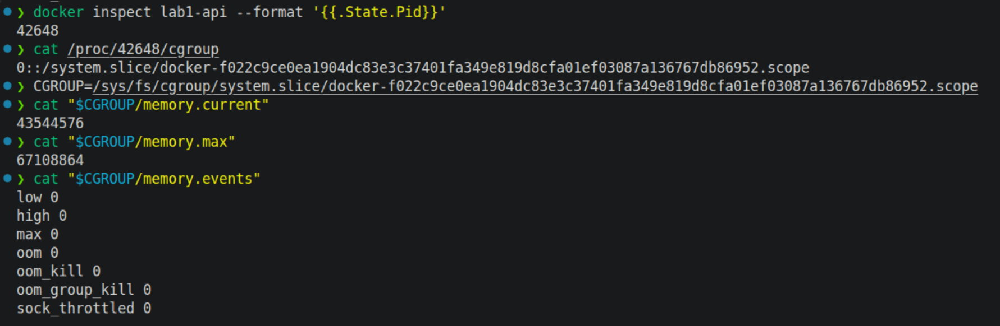

Теперь поднимем стек мониторинга. Нам нужно снять метрики с контейнера, для этого пойдет cAdvisor. Ну и соответственно графана и prometheus. Написан композ файл для этого: [тык](compose.yml); и конфиг файл для prometheus: [тык](prometheus.yml); и датасорс для графаны: [тык](grafana/provisioning/datasources/prometheus.yml).

Запуск:

```bash
docker compose up -d
```

Заходим в прометеус:

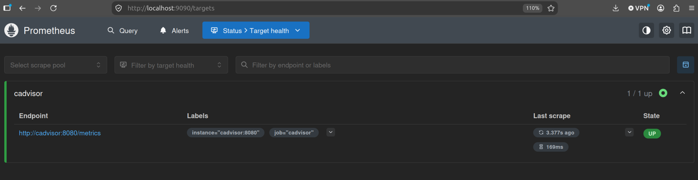

Видим, что есть наш cAdvisor со статусом up.

В нашем дашборде будем использовать три группы метрик:
- Использование памяти: текущая память контейнера, лимит памяти (покажет нам, если приложение близко к лимиту, то оно рискует словить ООМ)
- Использование цпу: текущий цпу контейнера, лимит цпу (покажет нам, хватает ли приложению выделенного цпу, грозит троттлингом)
- Троттлинг цпу (покажет долю периодов планирования процессорного времени, в которых контейнер был ограничен по цпу - ухудшение производительности)

Для памяти используем:
- `container_memory_working_set_bytes` - сколько памяти контейнер использует сейчас
- `container_spec_memory_limit_bytes` - лимит памяти установленный

Для цпу используем:
- `container_cpu_usage_seconds_total` - накопленное процессорное время контейнера
- `container_spec_cpu_quota` и `container_spec_cpu_period` - заданный конейтенеру лимит цпу

И для троттлинга:
- `container_cpu_cfs_periods_total` - количество периодов распределения цпу
- `container_cpu_cfs_throttled_periods_total` - количество периодов, в которых конейнер ограничен по цпу

И соответственно под алерты:
- Использование памяти > 80% от лимита
- Использование цпу > 85% от лимита
- Троттлинг цпу > 15% периодов планирования

Пойдем в графану и начнем настраивать дашборд.

Первая панель - использование памяти:

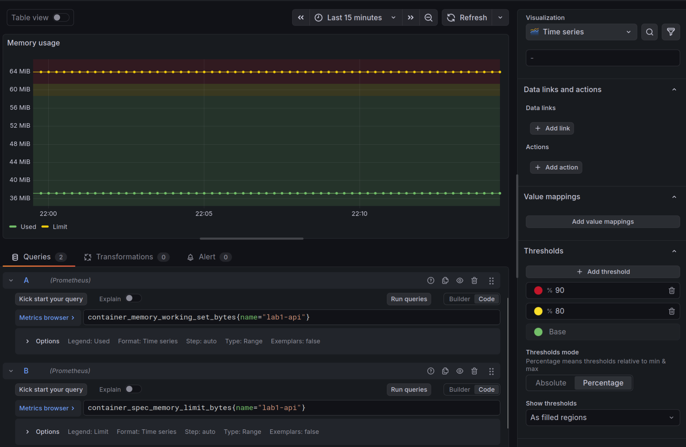

Тут два запроса - один показывает текущее потребление памяти, второй - лимит. Также установлен порог в 80%.

Вторая панель - использование цпу:

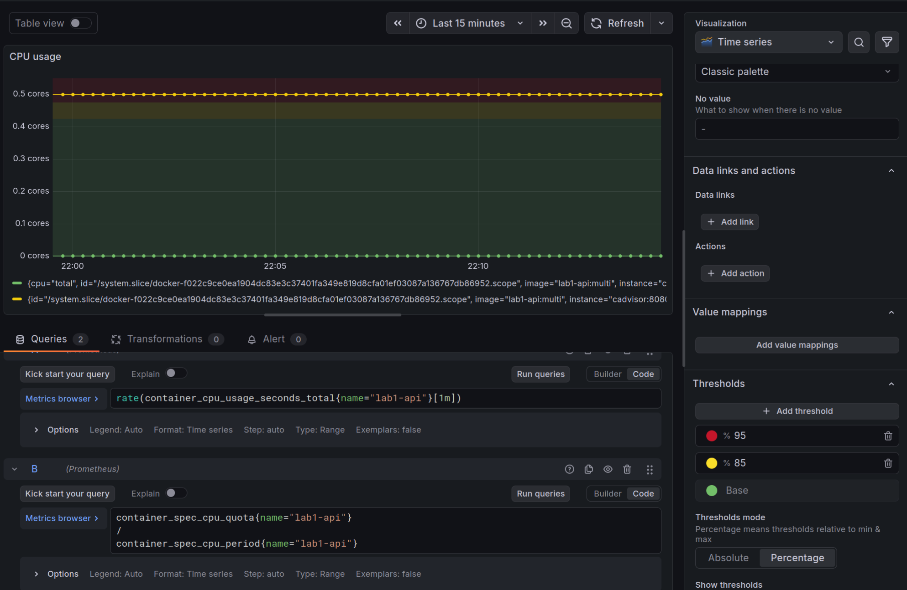

Тут тоже аналогично два запроса - текущее использование и лимит. Также установлен порог в 85%.

Третья панель - троттлинг цпу:

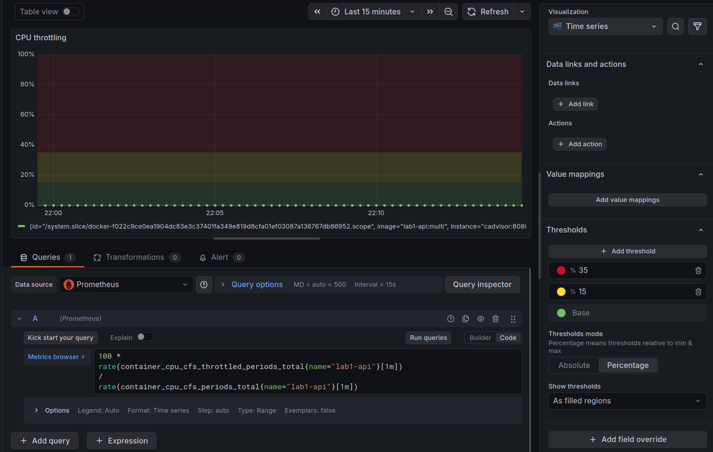

И вот весь дашборд:

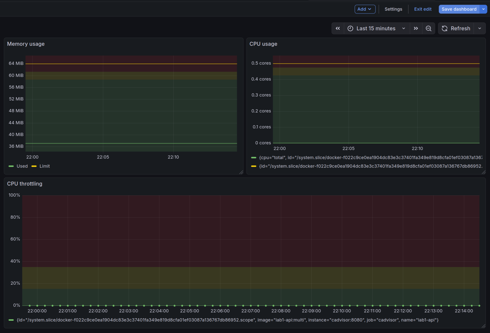

Дернем все наши эндпоинты (забьем память и цпу) и наблюдает как наши графики поползли вверх:

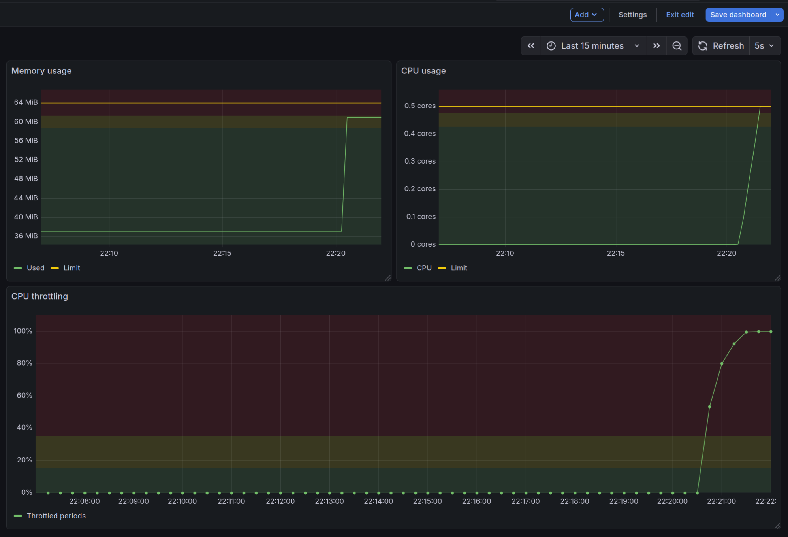