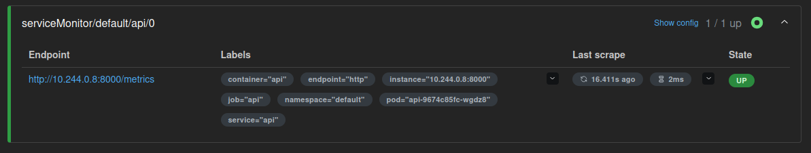

# Лаба 2 - Мониторинг

## Часть 0 - Свой сервис

Был реализован HTTP-сервис на Python FastAPI (`api/`, [main.py](api/main.py)). 

Эндпоинты: 

- `GET /health` — возвращает `ok`
- `GET /fail` — отвечает 500 и помечает span как error
- `GET /slow` — спит 1 - 3 секунды, вложенный span slow-op
- `GET /load?n=N` — пачка запросов к себе
- `GET /metrics` — метрики в формате Prometheus

Сервис сразу сделан наблюдаемым:

- RED метрики: `http_requests_total`, `http_errors_total`, гистограмма `http_request_duration_seconds`
- структурированные JSON-логи в stdout с полями `trace_id` / `span_id`
- инструментирование OpenTelemetry (FastAPI + ручные span) экспорт на `OTEL_EXPORTER_OTLP_ENDPOINT`

Докер файл присутствует [Dockerfile](api/Dockerfile)

Счётчики и гистограмма обновляются middleware на каждый запрос (кроме самого `/metrics`), то есть приложение само метрики никуда не пушит, забирает их Prometheus (pull-модель).

### Кластер и деплой через Helm

Кластер поднят через **kind** 

```bash
kind create cluster --name lab2

kubectl get nodes
NAME                 STATUS   ROLES           AGE   VERSION
lab2-control-plane   Ready    control-plane   18h   v1.32.2
```

Образ сервиса собран и загружен внутрь ноды kind

```bash
cd lab2/api
docker build -t lab2-api:1 .
kind load docker-image lab2-api:1 --name lab2
```

Для деплоя написан минимальный Helm-чарт [charts/api/](charts/api/):

- `Deployment` - под с контейнером `api`, probes на `/health`, переменные окружения `SELF_BASE_URL` для `/load`, `OTEL_SERVICE_NAME` для имени сервиса в трейсах, `OTEL_EXPORTER_OTLP_ENDPOINT` куда слать трейсы
- `Service` - ClusterIP `:8000`, DNS-имя `api` внутри кластера
- `ServiceMonitor` - чтобы Prometheus Operator подхватил scrape `/metrics`

```bash
helm upgrade --install api ./lab2/charts/api --set image.tag=1
kubectl get pods -l app=api
NAME                  READY   STATUS    RESTARTS      AGE
api-9674c85fc-wgdz8   1/1     Running   1 (67m ago)   18h
```

Проверка с хоста через port-forward, это туннель через API Kubernetes для отладки

```bash
kubectl port-forward svc/api 8000:8000
Forwarding from 127.0.0.1:8000 -> 8000
Forwarding from [::1]:8000 -> 8000
Handling connection for 8000

curl http://127.0.0.1:8000/health
ok
```

Итого на части 0 наш сервис наблюдаемый, упакован в образ, крутится в kind, отвечает на запросы

---


## Часть 1 - Метрики (Prometheus + Grafana)

Поставлен чарт `kube-prometheus-stack` в namespace `monitoring` (Prometheus + Grafana + Alertmanager + оператор)

```bash
helm repo add prometheus-community https://prometheus-community.github.io/helm-charts
helm repo update
kubectl create namespace monitoring

helm upgrade --install mon prometheus-community/kube-prometheus-stack \
  -n monitoring \
  --set grafana.adminPassword=admin
```

Поды в `monitoring` в статусе Running.

```bash
kubectl get pods -n monitoring
NAME                                                    READY   STATUS    RESTARTS      AGE
alertmanager-mon-kube-prometheus-stack-alertmanager-0   2/2     Running   2 (90m ago)   18h
mon-grafana-77bd45dbf5-txrgg                            3/3     Running   3 (90m ago)   18h
mon-kube-prometheus-stack-operator-76dcc45c75-hpmbb     1/1     Running   2 (90m ago)   18h
mon-kube-state-metrics-cfbf5bf8c-md7m6                  1/1     Running   2 (90m ago)   18h
mon-prometheus-node-exporter-nqlzl                      1/1     Running   1 (90m ago)   18h
prometheus-mon-kube-prometheus-stack-prometheus-0       2/2     Running   2 (90m ago)   18h
```


### Scrape сервиса api

Для Prometheus Operator цель описывается объектом **ServiceMonitor**: какой Service, какой port/path, какой интервал.

В чарт `api` добавлен [templates/servicemonitor.yaml](charts/api/templates/servicemonitor.yaml), важный label `release: mon` по умолчанию стек подхватывает ServiceMonitor именно с ним

```bash
helm upgrade --install api ./lab2/charts/api --set image.tag=1
kubectl get servicemonitor
NAME   AGE
api    18h
```

Проверка Targets в Prometheus:

```bash
kubectl port-forward -n monitoring svc/mon-kube-prometheus-stack-prometheus 9090:9090
```

ServiceMonitor подхвачен: target `api` в состоянии **UP**



После нагрузки

```bash
curl "http://127.0.0.1:8000/load?n=50"
curl http://127.0.0.1:8000/fail
curl http://127.0.0.1:8000/slow
```

в Prometheus появляется ряд `http_requests_total`. Нюанс по labels путь запроса из приложения `endpoint=/health` в Prometheus виден как `exported_endpoint`, потому что метка `endpoint` уже занята scrape-конфигом.

Прометеус успешно забирает метрики можем переходить к графане

### Дашборд RED в Grafana

```bash
kubectl port-forward -n monitoring svc/mon-grafana 3000:80
```

Создан дашборд `API` с тремя панелями

**Rate (RPS)**  интенсивность запросов:

```promql
sum(rate(http_requests_total[1m]))
```

`http_requests_total`  счётчик всего со старта `rate(...[1m])` переводит прирост в запросов/сек

**Error ratio** доля 5xx:

```promql
sum(rate(http_requests_total{status=~"5.."}[1m]))
/
clamp_min(sum(rate(http_requests_total[1m])), 0.001)
```

Числитель  - скорость ошибок, знаменатель - скорость всех запросов. Unit для графика **Percent (0.0-1.0)**, `clamp_min(..., 0.001)` не даёт делить на ноль, когда трафика нет

**Latency p95** - задержка:

```promql
histogram_quantile(
  0.95,
  sum by (le) (rate(http_request_duration_seconds_bucket[1m]))
)
```

Хранится корзинами и оценивает время, быстрее которого были 95% запросов.

Посмотрим на их вид в покое


Запросов еще не делали а нагрузка уже есть, это наши probes, readiness `GET /health` каждые 5 с (~0.2/s), liveness → `GET /health` каждые 10 с (~0.1/s)

После `/load`, `/fail`, `/slow` панели реагируют: растёт RPS, поднимается доля ошибок, p95 уезжает вверх на медленных запросах


Итого на части 1: scrape живой, Target UP, дашборд RED в Grafana реагирует на кнопки сервиса.

---


## Часть 2 - Логи

Loki сам ниоткуда логи не забирает, он только хранит и отдаёт по запросу. Собирает вывод подов отдельный агент Promtail. Он ставится как DaemonSet (ровно один под на каждой ноде), читает файлы логов контейнеров своей ноды из `/var/log/pods/...`, куда container runtime пишет stdout/stderr, навешивает labels из метаданных пода (`namespace`, `pod`, `app`, `container`) и отправляет строки в Loki.

### Установка стека

Сначала пробовал чарт `grafana/loki-stack` он поднял Loki **2.6.1** а в Grafana Datasource падал на health check новый клиент и старый Loki несовместимы, поэтому поставили актуальный Loki

```bash
helm uninstall loki -n monitoring

helm upgrade --install loki grafana/loki -n monitoring -f /tmp/loki-values.yaml

helm upgrade --install promtail grafana/promtail -n monitoring \
  --set "config.clients[0].url=http://loki-gateway.monitoring.svc:80/loki/api/v1/push"
```

Поды:

```bash
kubectl get pods -n monitoring | grep -Ei 'loki|promtail'
loki-0                                                  2/2     Running   0               4h17m
loki-canary-cxtgh                                       1/1     Running   0               4h17m
loki-gateway-6679d6d588-tvqcz                           1/1     Running   0               4h17m
promtail-c7z78                                          1/1     Running   0               4h17m
```

```bash
kubectl port-forward -n monitoring svc/mon-grafana 3000:80
```

Добавили в датасорс локи с таким адресом

```text
http://loki.monitoring.svc:3100
```

Поиск ошибки от `/fail`

```bash
kubectl port-forward svc/api 8000:8000
curl http://127.0.0.1:8000/fail
```

В Explore (datasource **Loki**, режим Code):

```logql
{namespace="default", app="api"} |= "intentional failure"
```

Нашлась ERROR-строка:

```json
{
  "timestamp": "2026-09-29T13:37:45.241220+00:00",
  "level": "ERROR",
  "logger": "api",
  "message": "intentional failure from /fail",
  "trace_id": "7c93961fe10aa1f637eac0a79b05e21f",
  "span_id": "c87f87a79fd1ea7b"
}
```


Итого на части 2: Loki хранит логи, Promtail собирает их с ноды, в той же Grafana видна ERROR-строка от `/fail` с `trace_id`

---


## Часть 3 - Трейсы

В `api` инструментирование уже было с части 0

- FastAPI auto-instrumentation - корневой span на входящий HTTP-запрос
- в `/slow` вручную создаётся вложенный span `slow-op` вокруг `asyncio.sleep`
- в `/fail` текущий span помечается `StatusCode.ERROR`
- в JSON-лог пишутся `trace_id` / `span_id` текущего контекста
- экспорт по OTLP/HTTP на `OTEL_EXPORTER_OTLP_ENDPOINT`

До этой части endpoint указывал на несуществующий `jaeger-collector` - в логах были ошибки резолва DNS. Нужно было только поднять Jaeger и поправить адрес

### Установка Jaeger all-in-one

```bash
helm repo add jaegertracing https://jaegertracing.github.io/helm-charts
helm repo update

helm upgrade --install jaeger jaegertracing/jaeger -n monitoring \
  --set provisionDataStore.cassandra=false \
  --set allInOne.enabled=true \
  --set storage.type=memory \
  --set agent.enabled=false \
  --set collector.enabled=false \
  --set query.enabled=false
```

Сервис `jaeger` в namespace `monitoring` слушает UI `:16686` и OTLP/HTTP `:4318`.

### Направление экспорта api

```bash
helm upgrade --install api ./lab2/charts/api \
  --set image.tag=1 \
  --set env.OTEL_EXPORTER_OTLP_ENDPOINT=http://jaeger.monitoring.svc:4318
```

После перезапуска пода ошибки `Failed to resolve 'jaeger-collector'` пропали - спаны уходят в Jaeger.

### Проверка в UI

```bash
kubectl port-forward -n monitoring svc/jaeger 16686:16686
kubectl port-forward svc/api 8000:8000

curl http://127.0.0.1:8000/slow
curl http://127.0.0.1:8000/fail
```

`/slow` - запрос ~2s, внутри вложенный span `slow-op`  на всю длительность


`/fail` - корневой span с ошибкой и кодом **500** (красный):


В Grafana Loki снова нашли ERROR от `/fail`:


`trace_id` из лога (`c25e761d05a807a21d818847962fda5f`) открывается в Jaeger - тот же трейс `/fail`:


Итого на части 3: Jaeger принимает OTLP, в водопаде виден длинный `slow-op`, `/fail` красный с 500, по `trace_id` из лога находится тот же трейс.

---


## Часть 4 - Алерты (Alertmanager + Karma)

Три правила лежат в [alerts/api-rules.yaml](alerts/api-rules.yaml): PrometheusRule с label `release: mon`, чтобы `kube-prometheus-stack` их подхватил


| Алерт               | Что ловит                    | Почему критично              | Как дежурному реагировать                                                      |
| ------------------- | ---------------------------- | ---------------------------- | ------------------------------------------------------------------------------ |
| `ApiHighErrorRate`  | доля 5xx > 5% дольше 1м      | пользователи получают ошибки | смотреть логи/трейсы `/fail`, откатить релиз или выключить плохой инстанс      |
| `ApiHighLatencyP95` | p95 > 1s дольше 1м           | сервис жив, но тормозит      | смотреть трейс `/slow` (span `slow-op`), искать искать даже если не получается |
| `ApiDown`           | цель `api` пропала из scrape | сервис недоступен            | проверить Deployment/поды, `kubectl describe`, вернуть реплики                 |


```bash
kubectl apply -f lab2/alerts/api-rules.yaml
```


### Нюанс ApiDown: `up == 0` vs `absent(up)`

Сначала стояло `up{job="api"} == 0`. При `kubectl scale deploy api --replicas=0` endpoints пустеют, Prometheus **убирает** цель из scrape - ряда `up` больше нет, условие `up == 0` не к чему применить, алерт молчит.

Рабочая формула покрывает оба случая:

```promql
up{job="api"} == 0 or absent(up{job="api"})
```

- `absent(up{job="api"})` - цели нет вовсе (Deployment снят, подов нет);
- `up{job="api"} == 0` - под есть, target в scrape есть, но `/metrics` не отвечает.

Одного `absent` мало: при живом поде с упавшим HTTP ряд `up` остаётся (со значением 0), и `absent` ничего не вернёт.

Для error rate добавлен `or vector(0)` в числитель: если 5xx-рядов нет, PromQL иначе отдаёт пустой результат, а не ноль.

### Провокация срабатываний

Error rate и latency - цикл по `/fail` и `/slow` ~2 минуты:

```bash

kubectl port-forward svc/api 8000:8000


while true; do
  curl -s -o /dev/null http://127.0.0.1:8000/fail
  curl -s -o /dev/null http://127.0.0.1:8000/slow
  sleep 1
done
```

ApiDown - отдельно, после остановки цикла:

```bash
kubectl scale deploy api --replicas=0
# ждём  1 мин ApiDown FIRING
kubectl scale deploy api --replicas=1
```

Важно: цикл без живого `port-forward` бьёт в пустоту - в Prometheus остаются только probes `/health`, алерты не загораются.

В Prometheus Alerts: сначала **PENDING** условие истинно, ждём  потом **FIRING**.


Остальные firing-алерты на скриншотах Alertmanager и Karma (`Watchdog`, `etcd`, `TargetDown`, `KubeProxy*`) шум дефолтных правил `kube-prometheus-stack` на kind `Watchdog` горит всегда специально это проверка, что цепочка Prometheus Alertmanager жива. `etcd` / `TargetDown` / `KubeProxy*` срабатывают, потому что в kind компоненты control plane слушают только localhost и Prometheus не может их скрейпить.

### Получатель в Alertmanager (webhook)

Alertmanager уже был в чарте `mon`. Добавлен receiver `webhook-receiver` 


На webhook.site приходит POST от `Alertmanager` с JSON (`alertname`, `severity`, `status: firing`):


### Karma

Официальный `chart.karma-dashboard.io` недоступен DNS. Поставили чарт wiremind:

```bash
helm repo add wiremind https://wiremind.github.io/wiremind-helm-charts
helm upgrade --install karma wiremind/karma -n monitoring \
  --set env[0].name=ALERTMANAGER_URI \
  --set env[0].value=http://mon-kube-prometheus-stack-alertmanager:9093

kubectl port-forward -n monitoring svc/karma 8080:80
```

Фильтр `Api` - свои критичные алерты отдельно от шума кластера:


Итого на части 4: три критичных правила в Prometheus, срабатывания в FIRING, доставка в webhook, обзор в Alertmanager и Karma. Весь observability-стек лабы (метрики, логи, трейсы, алерты) собран в Kubernetes через Helm.